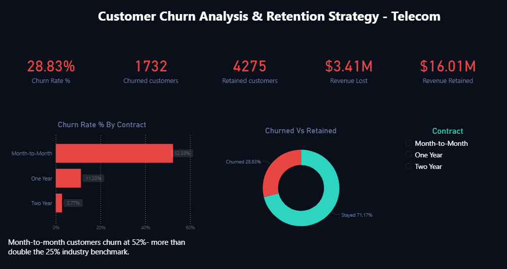
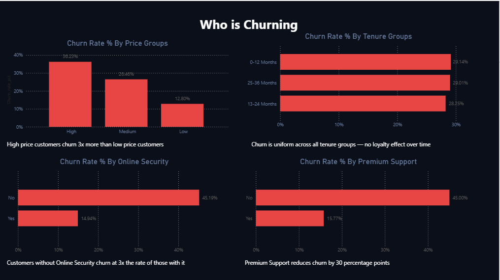
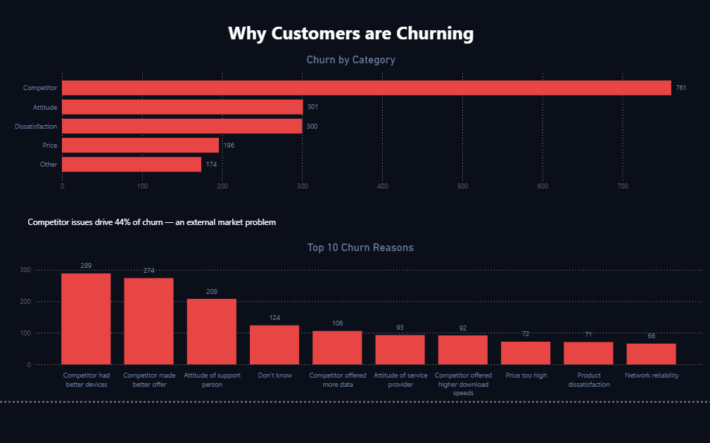
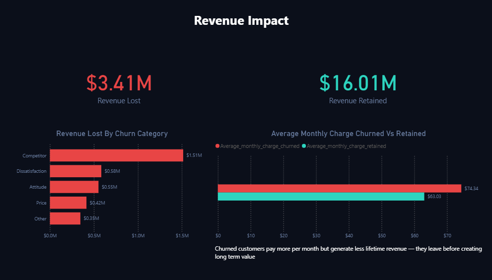
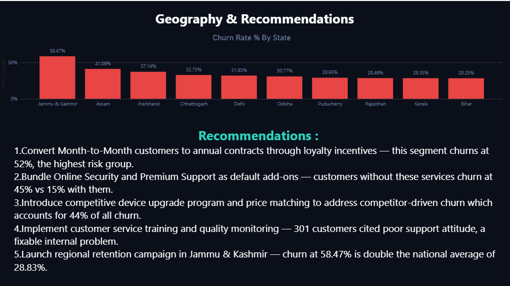

# Customer Churn Analysis & Retention Strategy — Telecom

## Project Background

Vertex Telecom Solutions is a telecom company established in 2020 that sells connectivity services including phone, internet, and streaming services, across India via a mobile app.

**Business Problem:** Vertex Telecom Solutions is currently experiencing a churn rate of 28.83%, exceeding the industry benchmark of 25%, resulting in $3.4M in lost revenue from 1,732 churned customers.

This project analyzes the following key areas:
- Overall churn rate and financial impact — 1,732 customers lost representing $3.4M in revenue
- Customer segmentation by contract type, price group, and tenure to identify the highest risk groups
- Root cause analysis of churn using churn categories and reasons
- Service adoption analysis — impact of Online Security and Premium Support on customer retention
- Geographic segmentation to identify high churn states and regional patterns

An interactive Power BI dashboard (.pbix) is available in this repository. 
Dashboard screenshots are embedded below across each section. [here](Customer_Churn_Analysis.pbix).

The SQL queries used for data cleaning and analysis can be found [here](Customer_Churn_Analysis.sql).

---

## Data Structure & Initial Checks

The dataset contains 6,418 rows and 32 columns covering customer demographics, service subscriptions, contract details, billing information, and churn status.

**Key columns include:**
- `Customer_Status` — whether a customer Churned, Stayed, or Joined
- `Contract` — Month-to-Month, One Year, or Two Year
- `Monthly_Charge` — recurring monthly billing amount
- `Churn_Category` and `Churn_Reason` — root cause of customer departure
- `Total_Revenue` — net lifetime revenue per customer

**Data Quality Checks Performed:**
- Identified and handled 1 row with an invalid negative monthly charge — set to NULL
- Replaced 1,390 empty strings in service columns with 'Not Applicable' for customers without internet service
- Excluded 411 'Joined' customers from churn rate calculations — they have not completed a billing cycle
- Verified tenure range: 1–36 months
- Verified monthly charge range: $18.25–$118.75

---

## Executive Summary

Analysis of 6,418 customer records identified a churn rate of 28.83%, exceeding the 25% industry benchmark and 
representing $3.4M in lost revenue from 1,732 churned customers.

Key finding: Churned customers pay significantly more per month ($74.34) than retained customers ($63.03), indicating the 
business is losing its highest-value customers first.

Month-to-Month contract holders churn at 52.38% — more than double the industry benchmark — making contract type the 
strongest predictor of churn. Competitor pressure drives 44% of all churn, while customers without Online Security churn 
at 3x the rate of those with it.

Five targeted retention recommendations are provided based on these findings.

---

## Insights Deep Dive

### 1. Who Is Churning?

**Contract Type**
- Month-to-Month customers churn at **52.38%** — more than double the 25% industry benchmark
- One Year customers churn at **11.23%**
- Two Year customers churn at only **2.77%**
- Month-to-Month customers have no contractual commitment, making it easy to leave at any time

**Price Group**
- High price customers (>$65/month) churn at **36.23%**
- Mid price customers ($30–$65/month) churn at **26.46%**
- Low price customers (<$30/month) churn at **11.71%**
- Churned customers pay an average of $74.34/month vs $63.03 for retained customers

**Tenure Group**
- Churn is uniform across all tenure groups at approximately **29%**
- 0–12 months: 29.14% | 13–24 months: 28.25% | 25–36 months: 29.01%
- Long-term customers are just as likely to leave as new customers — the company has no loyalty mechanism

---

### 2. Why Are Customers Churning?

| Category | Churned Customers | % of Total Churn |
|---|---|---|
| Competitor | 761 | 43.94% |
| Attitude | 301 | 17.38% |
| Dissatisfaction | 300 | 17.32% |
| Price | 196 | 11.32% |
| Other | 174 | 10.05% |

**Top 3 Churn Reasons:**
1. Competitor had better devices — 289 customers
2. Competitor made better offer — 274 customers
3. Attitude of support person — 208 customers

Competitor-driven churn is an external market problem. Attitude-related churn (301 customers) is entirely within the company's control and can be addressed through staff training.

---

### 3. Do Services Reduce Churn?

| Service | Without Service | With Service | Difference |
|---|---|---|---|
| Online Security | 45.19% | 14.94% | 30 points |
| Premium Support | 45.00% | 15.77% | 29 points |
| Streaming TV | 37.05% | 30.89% | 6 points |
| Streaming Movies | 37.08% | 30.95% | 6 points |
| Streaming Music | 36.98% | 30.38% | 6 points |

Online Security and Premium Support reduce churn by approximately 30 percentage points. Streaming services show only a 6 point difference — not strong enough to be a reliable retention tool.

---

### 4. Revenue Impact

| Status | Customers | Total Revenue | Avg Revenue Per Customer |
|---|---|---|---|
| Stayed | 4,275 | $16,010,148 | $3,745 |
| Churned | 1,732 | $3,411,961 | $1,969 |

- $3.4M in revenue lost to churn — approximately 17.6% of total revenue
- Churned customers pay **$74.34/month** on average vs **$63.03** for retained customers
- Despite paying more per month, churned customers generate less lifetime revenue ($1,969 vs $3,745) because they leave before creating long-term value

---

### 5. Geographic Analysis

| State | Churn Rate |
|---|---|
| Jammu & Kashmir | 58.47% |
| Assam | 41.09% |
| Jharkhand | 37.14% |
| Chhattisgarh | 32.73% |
| Delhi | 31.93% |
| **National Average** | **28.83%** |

Jammu & Kashmir shows a 58.47% churn rate — double the company national average of 28.83%. Two possible explanations: competitor pressure (better devices and offers) and network quality gaps specific to that region.

---

## Business Recommendations

| # | Recommendation | Target Segment | Evidence |
|---|---|---|---|
| 1 | Offer contract upgrade incentives | Month-to-Month customers | 52.38% churn vs 2.77% for Two Year |
| 2 | Bundle Online Security and Premium Support as default | High price and M-t-M customers | 45% churn without vs 15% with |
| 3 | Launch competitive device upgrade program | Competitor-churned customers | 44% of churn is competitor-driven |
| 4 | Implement customer service training and quality monitoring | All customers | 301 customers cited poor support attitude |
| 5 | Regional retention campaign in Jammu & Kashmir | J&K market | 58.47% churn — double national average |

---

## Tools Used

| Tool | Purpose |
|---|---|
| MySQL | Data cleaning, validation, and analysis queries |
| Power BI | Interactive dashboard and data visualization |
| Microsoft Excel / CSV | Raw dataset storage |

---

## Project Files

| File | Description |
|---|---|
| `Customer_Churn_Analysis.sql` | All SQL queries — data cleaning, metrics, and analysis |
| `Customer_Churn_Analysis.pbix` | Interactive Power BI dashboard (5 pages) |
| `Customer_Data.csv` | Raw dataset — 6,418 rows, 32 columns |
| `README.md` | Project documentation |

---

## Author

**Anmisha**
Data Analyst | SQL · Power BI · Excel
